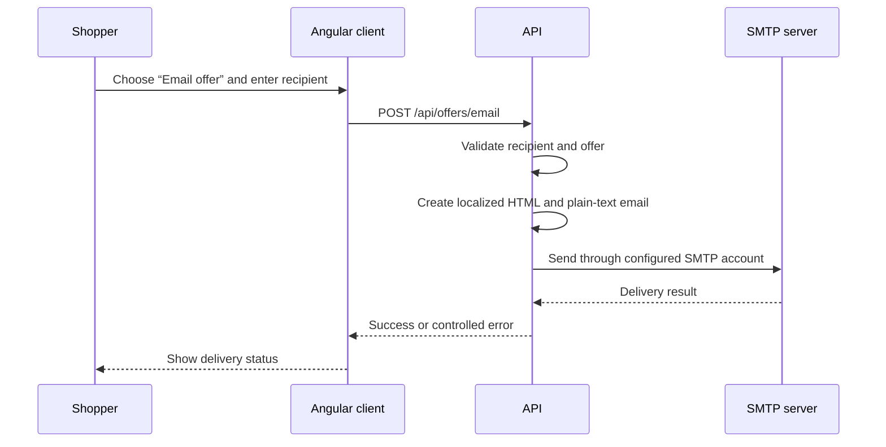

# PriceComparerWeb

PriceComparerWeb helps shoppers find and compare product offers from online stores. Enter a product name, model, or SKU; choose a currency; then review the best comparable offers in one place.

The interface is available in English, Portuguese (Brazil), and Spanish. Searches currently support BRL, USD, and EUR. Prices stay in their original currency: the application filters results by the chosen currency instead of converting them.

## How it works

### Product-search flow

```mermaid
flowchart LR
    U[Shopper] --> C[Angular client]
    C -->|POST /api/products/search| A[ASP.NET Core API]
    A --> V[Validate query, currency, and SearXNG configuration]
    V --> S[SearXNG JSON API]
    S --> F[Filter excluded hosts, score, deduplicate, and select candidates]
    F --> P[Fetch candidate product pages concurrently]
    P --> E[Extract price: JSON-LD → metadata → visible text]
    E --> Q[Keep matching currencies and remove low-price outliers]
    Q --> R[Rank by reliability, price, and confidence]
    R --> C
    C --> U
```



1. The client validates a product query and requires a search currency.
2. The API expands the query with shopping-intent terms and asks the self-hosted SearXNG instance for JSON results.
3. Results from configured non-commerce hosts and their subdomains are excluded. The remaining URLs are scored for product and purchase intent, deduplicated, and capped by configuration.
4. Candidate pages are fetched concurrently. The API reads prices in priority order from structured data (JSON-LD), product metadata, and finally visible page text.
5. Offers without a supported or matching currency are excluded. Very low prices—below 50% of the average offer price in a currency group—are treated as outliers.
6. Comparable offers are ranked primarily by reliability (HTTPS, extraction method, and confidence), then by price and stable tie-breakers. The client displays five at a time and can load more.

The API returns the successful offers together with attempted-source status and warnings, so partial failures do not hide usable results.

### Offer-email flow



Each email contains one selected offer’s title, original price, seller, and destination URL. It is localized using the active interface locale.

## Technologies


| Area | Technology | Role |
| --- | --- | --- |
| Frontend | Angular 21, TypeScript, RxJS | Standalone, signal-based UI; reactive search and email forms |
| Backend | ASP.NET Core Minimal API on .NET 10, C# | HTTP API, validation, orchestration, CORS, and configuration |
| HTML parsing | AngleSharp | Reads candidate pages and makes product data available to the extractor |
| Search discovery | SearXNG | Self-hosted metasearch service queried through its JSON API |
| Email | SMTP / `System.Net.Mail` | Sends selected offers through a configured mail provider |
| Containerization | Docker, Docker Compose, Nginx | Runs the client, API, and SearXNG as a local stack; Nginx serves the production client and proxies `/api` |
| Testing | Vitest via Angular CLI | Frontend unit tests |

## Project layout

```text
client/    Angular application and Nginx production image
server/    ASP.NET Core API, product search, scraping, and email services
searxng/   Local SearXNG configuration
tests/     Backend verification harness
openspec/  Change artifacts and specifications
```

## API endpoints

| Method | Endpoint | Purpose |
| --- | --- | --- |
| `POST` | `/api/products/search` | Finds, extracts, filters, and ranks product offers |
| `POST` | `/api/offers/email` | Sends one selected offer to a recipient email address |
| `POST` | `/api/scrape` | Fetches a page and returns structured page metadata for generic scraping |

Example product search:

```bash
curl -X POST http://localhost:5235/api/products/search \
  -H "Content-Type: application/json" \
  -d '{"query":"iPhone 15 128GB","currency":"BRL"}'
```

## Run locally

### Prerequisites

- .NET 10 SDK
- Node.js 20.19 or newer
- A SearXNG instance with JSON output enabled, or Docker Compose

### Start the API

```bash
dotnet run --project server/PriceComparerWeb.Api.csproj --launch-profile http
```

The development API listens at `http://localhost:5235`.

### Start the client

From `client/`:

```bash
npm install
npm start
```

Open `http://localhost:4200`. The Angular development server proxies `/api` requests to `http://localhost:5235`.

### Configure SearXNG

Development defaults to `http://localhost:8080`. SearXNG must permit the `json` output format:

```bash
curl "http://localhost:8080/search?q=test&format=json"
```

If it returns `403`, enable the `json` format in SearXNG’s `settings.yml`.

### Start the complete stack with Docker Compose

```bash
docker compose up --build
```

Then open `http://localhost:4200`. The API is available at `http://localhost:5050`; SearXNG is available at `http://localhost:8080`. Within the Compose network, the API reaches SearXNG at `http://searxng:8080`.

Stop the stack with:

```bash
docker compose down
```

## Email configuration

Copy `.env.example` to `.env`, replace the placeholders, and keep `.env` out of version control. Environment variables take precedence over values loaded from `.env`.

```text
Smtp__Host=smtp.example.com
Smtp__Port=587
Smtp__Username=account@example.com
Smtp__Password=<secret>
Smtp__FromAddress=account@example.com
Smtp__FromName=PriceComparer
Smtp__EnableSsl=true
```

For Gmail, use `smtp.gmail.com`, port `587`, and a 16-character Google App Password. This requires 2-Step Verification; a normal Google account password will not work. A mail-capture service or disposable SMTP provider is useful for local development.

`POST /api/offers/email` returns a controlled service error when SMTP is missing or invalid, and a delivery error when the configured server cannot accept the message.

## Configuration notes

- `ProductSearch:ExcludedHosts` replaces the default excluded-host list in deployment configuration. Matching is case-insensitive and also covers subdomains.
- `ProductSearch:MaxCandidates` controls the number of discovery candidates processed; `ProductSearch:MaxConcurrency` controls simultaneous page fetches.
- Do not commit credentials, private endpoints, or a populated `.env` file.

## Verify changes

```bash
dotnet build server/PriceComparerWeb.Api.csproj
cd client && npm run build
cd client && npm run test -- --watch=false
```
